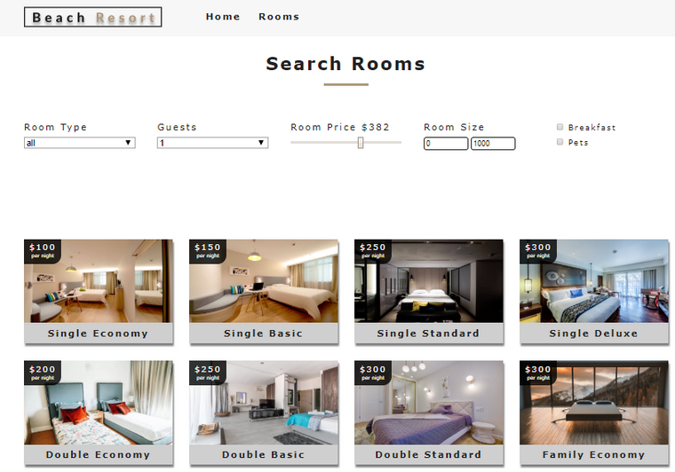

Proyecto de ejemplo de una aplicación de React. 

El sito permite buscar hoteles por un criterio de búsqueda: por categoría, precio, capacidad u otras características.

  

En el ejemplo de incluye el uso de distintas técnicas:
* Routers
* Componentes funcionales
* Utilización de Context
* Hooks (useContext)
* Uso de la librería styled-components

Para ejecutar la aplicacion escribir el siguiente comando: 

### `yarn start`

Ejecuta la aplicacion en modo desaroollo

Abrir [http://localhost:3000](http://localhost:3000) en el navefador.

